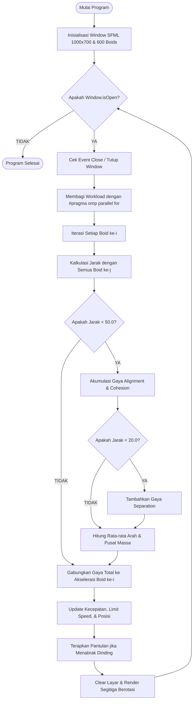
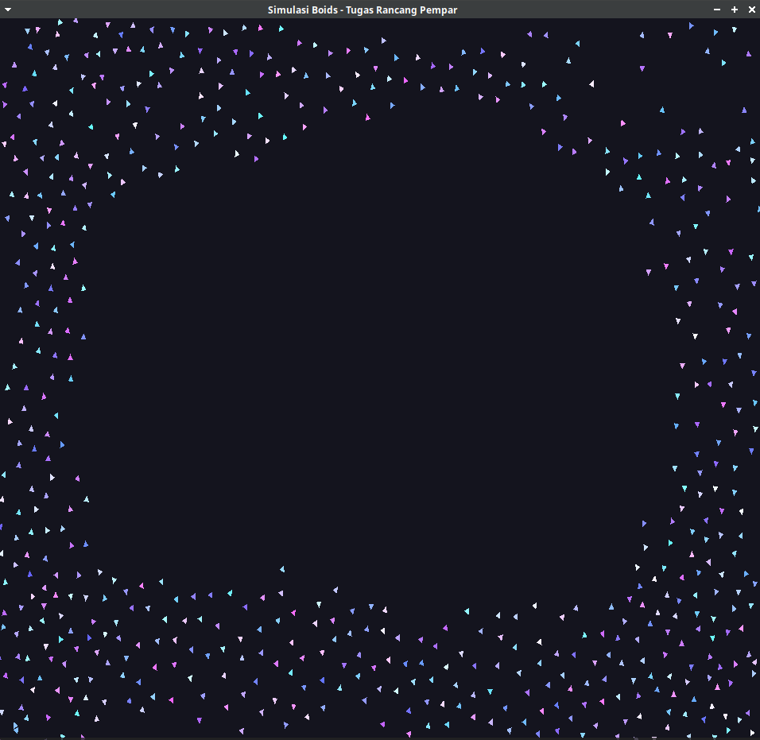

# Tugas-Rancang-Pempar

## 1. Identitas Praktikan
* **Nama: Feliks Abednego Narendra P**
* **NIM: 622023005**

## 2. Setup Development Environment
Proyek ini dikembangkan di lingkungan OS Linux. Berikut adalah langkah kompilasi dan pemasangan dependensinya:

**Pemasangan Dependensi:**
Dibutuhkan kompilator C++ (`g++`) yang mendukung OpenMP dan pustaka grafis SFML.
`sudo apt update`
`sudo apt install build-essential libsfml-dev`

**Langkah Kompilasi:**
Kompilasi dilakukan dengan menyertakan *flag* `-fopenmp` agar paralelisme berjalan.
`g++ main.cpp -o simulasi -fopenmp -lsfml-graphics -lsfml-window -lsfml-system`

---

## 3. Penjelasan Cara Kerja Program
Aplikasi ini adalah *particle system* 2D yang mensimulasikan pergerakan 600 partikel secara bersamaan (Boids). 

Setiap partikel bergerak mengikuti 3 aturan interaksi utama terhadap partikel di sekitarnya:
* **Separation:** Jika jarak dengan partikel lain sangat dekat (<20 piksel), partikel akan saling menjauh untuk menghindari tabrakan.
* **Alignment:** Partikel menghitung rata-rata kecepatan partikel di sekitarnya dan menyamakan arah geraknya.
* **Cohesion:** Partikel mencari titik pusat massa dari kawanannya dan bergerak mendekat agar tetap bergerombol.

---
## 4. Flowchart Program
Berikut adalah bagan alir dari simulasi interaksi Boids berdasarkan implementasi kode:


---

## 5. Penjelasan Implementasi Paralel yang Digunakan
Paralelisme diterapkan pada bagian utama simulasi menggunakan OpenMP.
Kalkulasi interaksi antar partikel merupakan proses terberat, karena setiap frame (60 kali per detik), program harus menghitung jarak dari 600 partikel ke 599 partikel lainnya ($600 \times 600$ iterasi).
Dengan menambahkan #pragma omp parallel for schedule(dynamic) pada loop kalkulasi interaksi, pembagian pekerjaan (workload) didistribusikan secara otomatis ke seluruh thread CPU. Hal ini memecah beban komputasi secara efisien sehingga simulasi partikel kompleks ini tetap berjalan real-time tanpa lag.
## 6. Hasil Pengujian Program
Berikut adalah bukti pengujian program:

**Bukti Kompilasi Tanpa Error:**


**Bukti Simulasi Berjalan (Visualisasi Grafis):**


## 7. Dokumentasi Penggunaan Program
Program ini disertakan dalam bentuk *prebuilt binary* Linux bernama `simulasi`.
1. Buka Terminal pada direktori tempat file biner ini berada.
2. Jalankan program dengan mengetik perintah:
   ```
   ./simulasi
   ```
